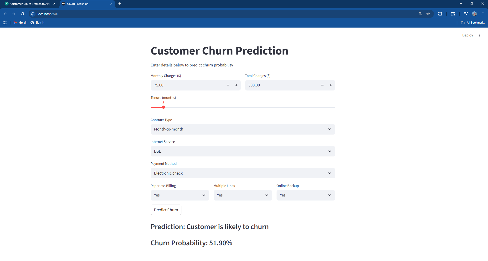
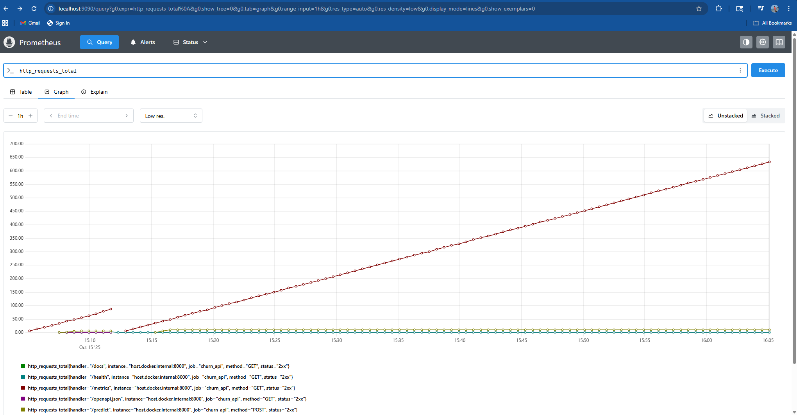
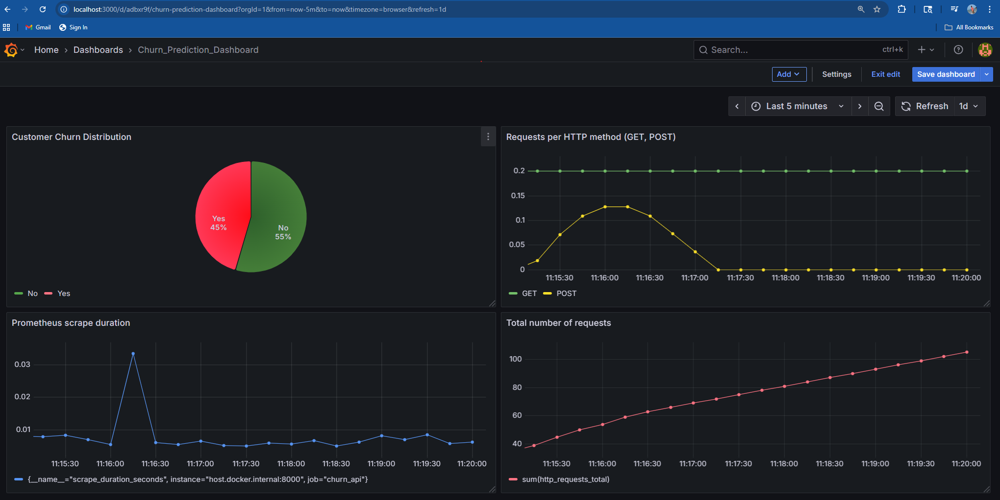

#  Customer Churn Prediction API with Real-Time Monitoring

An end-to-end **Machine Learning ** project that predicts customer churn probability using **FastAPI**, **XGBoost**, **Prometheus**, and **Grafana**.  
Includes a user-friendly **Streamlit dashboard** for live predictions and real-time system metrics visualization.


##  Tech Stack
**Backend:** FastAPI, Python, Pandas, XGBoost  
**Frontend:** Streamlit  
**Monitoring:** Prometheus + Grafana  
**Containerization:** Docker, Docker Compose  
**Deployment:** Render (Free Tier)


##  Features
-  REST API for real-time churn prediction  
-  Prometheus metrics for API performance and inference speed  
-  Grafana dashboard showing **churn distribution**, **system metrics**  
-  Streamlit UI for interactive predictions  
-  Docker-based deployment for reproducibility  
-  One-click deployment on Render  

##  Project Structure
CHURN_PREDICTION_API/
│
├── app/
│ ├── main.py
│
├── src/
│ ├── xgb_churn_best.pkl
│ ├── Telecom_processed.csv
│ └── Churn_Prediction.ipynb
│
├── obs/
│ └── prometheus.yml
│
├── Streamlit_app.py
├── docker-compose.yml
├── Dockerfile
├── render.yaml
├── requirements.txt
└── README.md

##  Run Locally
```bash
git clone https://github.com/Narendra1112/churn-prediction-api.git
cd churn-prediction-api
pip install -r requirements.txt
uvicorn app.main:app --reload
streamlit run Streamlit_app.py

## Run Monitoring Tools

docker-compose up -d

## Deploy on Render

services:
  - type: web
    name: churn-api
    env: python
    buildCommand: "pip install -r requirements.txt"
    startCommand: "uvicorn app.main:app --host 0.0.0.0 --port 10000"
    plan: free

## Screenshots

**FastAPI Swagger UI**


**Streamlit Prediction UI**


**Prometheus Metrics**


**Grafana Dashboard**



Model Overview

Model: XGBoost Classifier

Target: Churn (Yes / No)

Top Features: Tenure, MonthlyCharges, TotalCharges, Contract, InternetService, PaymentMethod, PaperlessBilling, MultipleLines, OnlineBackup, TechSupport

Example API Input
{
  "MonthlyCharges": 75.0,
  "Tenure": 5,
  "TotalCharges": 500.0,
  "Contract": "Month-to-month",
  "InternetService": "DSL",
  "PaymentMethod": "Electronic check",
  "PaperlessBilling": "Yes",
  "MultipleLines": "Yes",
  "OnlineBackup": "Yes"
}

 Output
{
  "prediction": "Customer is likely to churn",
  "churn_probability": 0.519
}